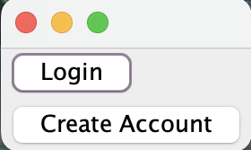
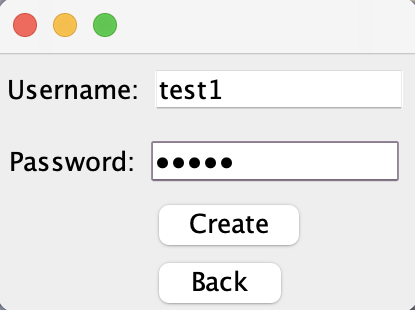
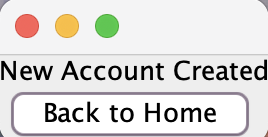
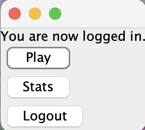
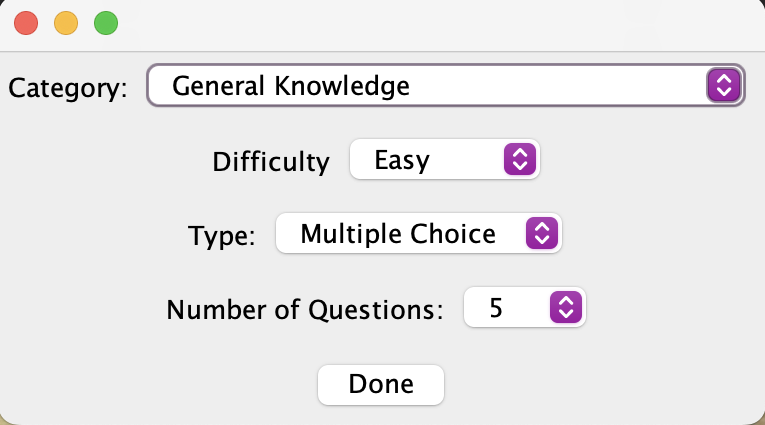
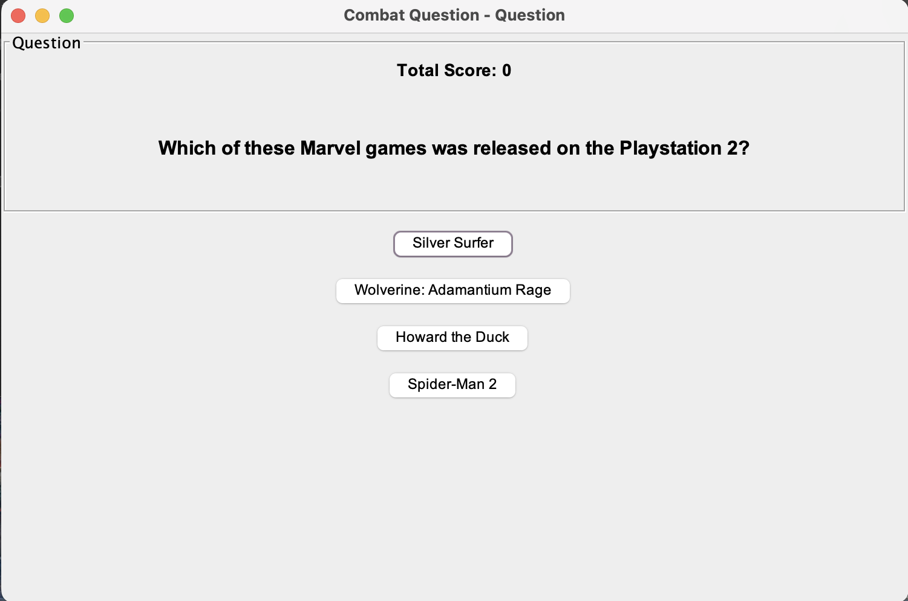
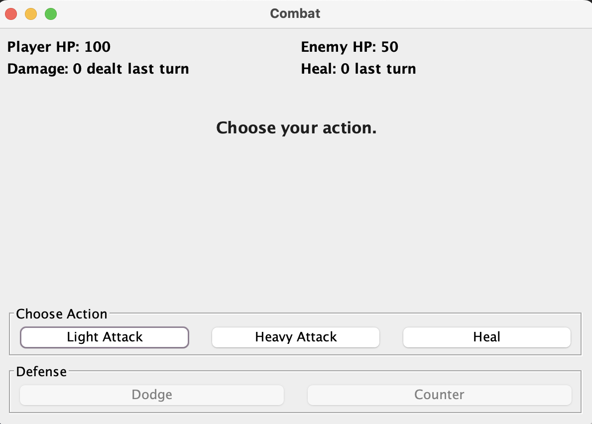
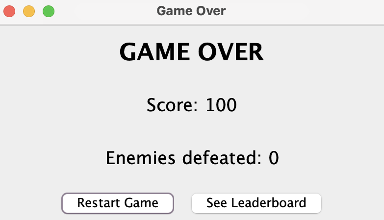
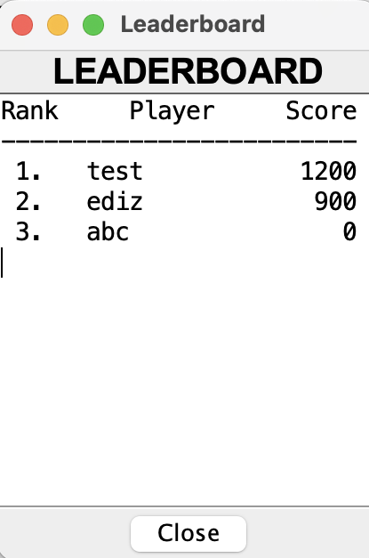

# Trivia Combat Game

A Java-based trivia game application that combines knowledge-based questions with turn-based combat mechanics. Players test their trivia knowledge across various categories and difficulty levels while engaging in combat encounters with enemies.

## Table of Contents
- [Overview](#overview)
- [Features](#features)
- [Architecture](#architecture)
- [User Stories](#user-stories)
- [API Information](#api-information)
- [Technology Stack](#technology-stack)
- [Setup Instructions](#setup-instructions)
- [Screenshots](#screenshots)
- [Team Members](#team-members)

## Overview

Trivia Combat Game is an interactive desktop application built with Java Swing that challenges players to answer trivia questions correctly to succeed in combat. The game features:

- **User Authentication**: Secure signup and login system
- **Customizable Gameplay**: Select question categories, difficulty levels, and question types
- **Combat System**: Turn-based combat where correct answers lead to successful attacks
- **Score Tracking**: Comprehensive leaderboard system to track high scores
- **Question Variety**: Multiple choice and true/false questions across various categories

## Features

### Implemented Features
- ✅ User account creation and login
- ✅ Category and difficulty selection
- ✅ Real-time trivia question fetching
- ✅ Answer submission and scoring
- ✅ Turn-based combat system
- ✅ High score leaderboard
- ✅ Score persistence

### Planned Features
- 🔲 Two-player mode
- 🔲 Statistics tracking
- 🔲 Achievement system

## Architecture

The application follows a **Clean Architecture** pattern with clear separation of concerns:

```
src/main/java/
├── app/                    # Application entry point and builder
├── entity/                 # Core business entities (Player, Question, GameState, etc.)
├── use_case/              # Business logic (Interactors)
├── interface_adapter/     # Controllers and ViewModels
├── view/                  # UI components (Swing views)
├── data_access/           # External data sources (API, file system)
└── data_access_object/    # Data persistence layer
```

### Key Design Patterns
- **Use Case Pattern**: Clear separation of business logic
- **Model-View-Controller (MVC)**: UI and business logic separation
- **Dependency Inversion**: Interfaces for loose coupling
- **Builder Pattern**: Flexible application construction

## User Stories

The following user stories represent the core functionality of the application:

| Use Case                                               | Description                                                                       | Responsible Team Member | Status |
|--------------------------------------------------------|-----------------------------------------------------------------------------------|------------------------|--------|
| **Use Case 1: Sign up and sign in**                    | Users can create a new account or sign into an existing one                       | _Eliza Azaro_          | ✅ Implemented |
| **Use Case 2: Select Category and Difficulty**         | Users can choose question category and difficulty level before playing            | _Wei Xia_       | ✅ Implemented |
| **Use Case 3: Choose combat actions to fight enemies** | Users can choose actions to fight enemies in a turn-based combat                  | _Ediz Cagan Uysal_       | ✅ Implemented |
| **Use Case 4: Answer Questions**                       | Players answer trivia questions during gameplay, with scoring based on correctness | _Yanzhao Wang_       | ✅ Implemented |
| **Use Case 5: Use Points**                             | Users can use experience points to enhance their stats                            | _Matei Tarcea_       | ✅ Implemented |
| **Use Case 6: See Leaderboard**                        | Users can see their score compared to other player's scores in a leaderboard      | _Annie Wang_       | ✅ Implemented |

_Note: Team member assignments should be updated as tasks are distributed. See TeamContract.md for team structure._

## API Information

### Open Trivia Database (OpenTDB)

The application uses the **Open Trivia Database API** to fetch trivia questions dynamically.

- **API URL**: `https://opentdb.com/api.php`
- **API Key Required**: ❌ No
- **Documentation**: [OpenTDB API Documentation](https://opentdb.com/api_config.php)

#### API Integration Details

- **Question Fetcher**: `data_access.Gateway.triviaapi.ApiQuestionFetcher`
- **Supported Parameters**:
  - `amount`: Number of questions (1-50)
  - `category`: Question category ID
  - `difficulty`: easy, medium, or hard
  - `type`: multiple (choice) or boolean (true/false)

#### Example API Request
```
GET https://opentdb.com/api.php?amount=10&category=9&difficulty=easy&type=multiple
```

#### API Response Format
The API returns JSON with:
- `response_code`: Status code (0 = success)
- `results`: Array of question objects containing:
  - `question`: HTML-encoded question text
  - `correct_answer`: Correct answer
  - `incorrect_answers`: Array of wrong answers
  - `difficulty`: Question difficulty level
  - `type`: Question type (multiple/boolean)
  - `category`: Question category

#### Rate Limiting
The API is free and does not require authentication. However, rate limiting may apply during high-traffic periods.

## Technology Stack

- **Language**: Java 25
- **UI Framework**: Java Swing
- **Build Tool**: Maven 3.9.11
- **Testing**: JUnit 5
- **HTTP Client**: OkHttp 4.12.0
- **JSON Processing**: org.json 20240303

## Setup Instructions

### Prerequisites
- Java Development Kit (JDK) 25 or higher
- Maven 3.6.0 or higher
- Git

### Installation Steps

1. **Clone the repository**
   ```bash
   git clone <repository-url>
   cd team-project-17
   ```

2. **Compile the project**
   ```bash
   mvn clean compile
   ```

3. **Run the application**
   ```bash
   mvn exec:java -Dexec.mainClass="app.Main"
   ```

   Or using Maven exec plugin:
   ```bash
   mvn exec:java
   ```

### Running Tests

Run all tests:
```bash
mvn test
```

Run specific test class:
```bash
mvn test -Dtest=GameplayInteractorTest
```

### Building the Project

Create a JAR file:
```bash
mvn clean package
```

The compiled JAR will be in `target/TeamProject-1.0-SNAPSHOT.jar`

## Screenshots

### Application Screenshots

_Screenshots demonstrating current functionality will be added here._

- Home Screen

- Login/Signup Interface



- Preferences Selection (Category/Difficulty)

- Gameplay View with Questions

- Combat Interface

- Game Over View

- Leaderboard View

---

## Team Members

- Eliza Azaro
- Ediz Cagan Uysal
- Wei Xia
- Matei Tarcea
- Yanzhao Wang
- Annie Wang

For team collaboration details, see [TeamContract.md](./TeamContract.md)

---

## License

This project is developed as part of a course assignment.

## Acknowledgments

- Open Trivia Database for providing free trivia question API
- Course instructors and TAs for guidance and support
